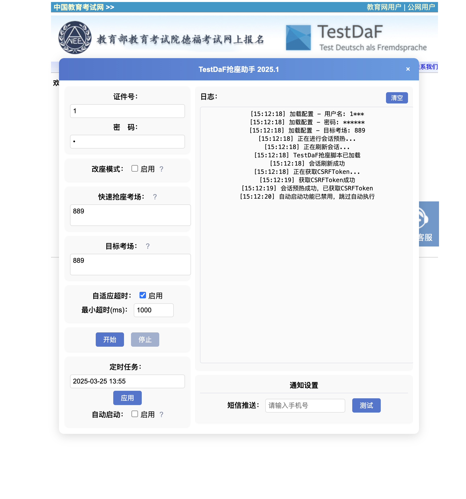

# testdaf-auto-booking
适用于德福考试（TestDaF）报名官网的油猴（Tampermonkey）自动抢座脚本，提供自动登录、抢座、验证码OCR识别以及错误自动重试等功能。

## 程序界面

<!-- 程序运行示例 -->

## 功能介绍

### 自动登录
- 自动保存并填充用户登录信息（证件号与密码本地加密存储）
- 使用MD5哈希算法加密密码，保证安全性

### 智能抢座
- 支持设定具体的抢座开始时间（默认下午14:00）
- 支持设置多个目标考点，按优先级自动选择
- 提供快速抢座模式，跳过考点状态查询直接尝试抢座

### OCR验证码识别
- 支持自定义OCR服务自动识别验证码
- 识别失败自动重试，并支持手动输入验证码

### 网络异常自动重试
- 网络请求失败或超时自动重试
- 自动调整网络请求超时时间，确保抢座过程的稳定性

### 参数自定义
- 可自由设置请求间隔、超时时间、考点优先级、OCR服务地址等
- 支持自定义抢座策略与改座模式

### 用户界面
- 内置于页面右侧的控制面板，设置便捷直观
- 实时日志显示程序运行状态与错误信息，方便用户监控

### 推送通知
- 支持设置手机短信通知，抢座成功时自动发送短信提醒（需自备短信服务）

## 安装步骤

1. 安装浏览器扩展：[Tampermonkey官网](https://www.tampermonkey.net/)
2. 新建脚本并复制`testdaf.js`的全部内容后保存
3. 打开[TestDaF报名官网](https://testdaf.neea.cn) 即可自动加载使用

## 使用方法

1. 在控制面板中设置证件号、密码以及目标考点
2. 设置自动启动时间（推荐提前几分钟执行）
3. 按需开启OCR验证码识别功能并填写OCR接口地址
4. 根据需求配置短信通知功能

## 注意事项

- 此脚本仅供个人学习研究，禁止用于商业用途或非法目的
- 抢座成功概率受服务器响应、网络状况影响，无法保证100%成功
- 建议提前模拟测试，确保所有功能正常运行

## 开源协议

MIT License

